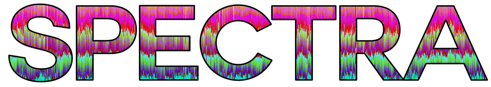

# Introduction
Spectra is a software toolkit for the analysis of trinucleotide distributions. Spectra was developed as a way to measure and visualize the location of highly repetitious elements along chromosomal sequences, as evidenced through trinucleotide distributions. The included tools allow for counting trinucleotide elements, transforming count results, and visualizing with Spectra graphs.

# Features
- Fast counting of trinucleotide elements across sequence windows broken down to any preferred width and any amount of spacing or overlap.
- Many supported input formats. If Biopython.SeqIO supports the format, it should be able to take the input.
- Spectra data can be transformed through normalizations from a global frequency, removal of conforming frequencies, or consolidation of multiple windows without needing to rerun the primary analysis.
- Data can be analyzed to detect changes in 3-mer frequencies across sequences.
- Spectra graphs can be generated in numerous formats supported by R-`ggplot2` or python3-`plotnine`
- Can be run entirely with python from count through visualization (experimental) or with visualization in R.

# Requirements
- **Python 3.x**
  - **Required packages**
    - biopython, numpy, pandas, ruptures
  - **Optional packages**
    - kaleido, matplotlib, multiprocessing, plotly, scipy
- **R 4.x**
  - **Required packages**
      - ggplot2, dplyr, optparse,tidyr
  - **Optional packages**
    - ape, egg, svglite

# Installation
Required
```shell
pip install biopython numpy pandas ruptures
Rscript -e "install.packages(c('ggplot2','dplyr','optparse','tidyr'), dependencies=TRUE)"
```
Optional
```shell
pip install matplotlib multiprocessing plotnine scipy
Rscript -e "install.packages(c('ape','egg','svglite'), dependencies=TRUE)"
```

# Usage

---
### Count
Basic usage: `spectra.py count -i INPUT_SEQUENCE -o OUTPUT_TSV`

Generate absolute trinucleotide counts or canonical counts (`-c`) from input nucleotide sequence data
(`-i INPUT_SEQUENCE`) and output a tabular-separated values file (`-o OUTPUT_TSV`). Window size set with `-w WIDTH` and
spaced with `-s SPACING`. For non-overlapping windows, width and spacing must be the same. For data with multpiple data
sources, this can be run together with `-l` and data sources will be defined by the first underscore in sequence
headers. Frequencies can optionally be reported instead of raw counts (`-p`).

### Plot
Basic usage: `spectra-plot.r -i INPUT_TSV`

Generate a plot for each sequence as a png. Output file prefix and image type can be supplied with
`-o output_name.tiff` and dpi resolution set with `-r 300`. Plot subset of libraries with `-l LIBRARY1,LIBRARY2,...`,
subset of sequences with `-s SEQUENCE1,SEQUENCE2,...`, or partial sequence range with `-w 1,1000000`. Regular
expressions to filter libraries and sequences supported with `-e`. Legend shown with `-l`. Axis labels ommited with
`-a`. Plotting scale set with `-k` for scaling and  `-x N` to set scale to N million base pairs every 1 inch. If data
already supplied as frequencies, use `-f`. Datasets with multiple libraries defaults to a faceted plot for each sequence
header shared between libraries.

External data sources can be supplied to plot in addition to spectra profile. GFF data can be plotted using
`-g GFF_FILE -t GFF,TRACKS,TO,INCLUDE`. Outputs from Tandem Repeat Finder can be supplied by converting the output
with [scripts/utils/trfWindows.py](scripts/utils/trfWindows.py) and visualized with `-z TRFFILE.tsv`

A circular plot can be produced with `-c` and the plotting length can be set with `-u LENGTH` to scale alongside other
datasets.

### Analyze
Basic usage: `spectra.py analyze -i INPUT_TSV`

Detect breakpoints along sequences where spectra identity shifts using 
[Ruptures](https://centre-borelli.github.io/ruptures-docs/). Reports the boundaries of each segment, or reports a
modified Spectra tsv and frequency profile of segments using `-o OUTPUT_TSV`. Breakpoint penalty can be set with
`-p PENALTY`, which defaults to 1000000, and the minimum number of Spectra windows in a segment can be set with 
`-s WINDOWS`, which defaults to 5. Spectra data constructed from aligned sequence data can be processed with `-a`
and breakpoints can be inferred from Spectra frequencies with `-f`.

### Transform
Basic usage: `spectra.py transform -i INPUT_TSV -o OUTPUT_TSV`

Transform Spectra data tsv in a number of ways. Convert from counts to frequencies with `-c`, or from frequencies to
counts with `-c -f`. Convert absolute trinucleotide counts to canonical counts with `-y`. Windows can be increased by
whole number factors with `-s N` to summarize N windows to 1. Outlier frequencies from the genome-wide means can be
identified with `-n`. Additional outputs can be produced for the outlier and normal windows with `-n`. Global
frequencies can be reported with `-p`

### Collate
Basic usage: `spectra.py collate -i INPUT_TSV1 INPUT_TSV2 ... -o OUTPUT_TSV`

Multiple Spectra data tsvs can be collated together, such as individual runs of multiple genomes.

### Query
Basic usage: `spectra.py query -i INPUT_SEQUENCE -o OUTPUT_TSV -q QUERY1,QUERY2,...`
Using the Spectra-count algorithm, query motifs can be supplied for counting and visualization. Parameterization
follows Spectra-count. Visualization can be performed with `query-plot.r $i INPUT_TSV` using similar parameterization
as Spectra-plot.