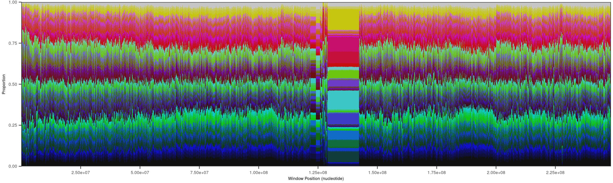

Spectra: Software for analysis and visualization of 3-mers in genetic sequence data
==================================================================================================

## Introduction

Spectra is a software toolkit for the analysis of 3-mer (trinucleotide) distributions. Spectra was developed as a way
to assess regions of DNA that are comprised of unique sets of k-mers from one another, and to break those k-mers down
to their basal elements. This offers the ability to measure and localize shifts in genetic composition and identify the
relation between various tandemly repetitive elements.

Spectra is run as a script through Python 3.x and R 4.x with a low overhead of required packages. It's primarily
developed and tested in WSL2 Debian.

## Installing with conda
For Linux:
```shell
cd Spectra
conda env create -n spectra
conda activate spectra
```

## Installing standalone
For Linux:
```shell
pip install biopython numpy pandas plotly ruptures scipy
Rscript -e "install.packages(c('ape','egg','ggplot2','dplyr','optparse','svglite','tidyr'), dependencies=TRUE)"
```

## Test data - [T2T-CHM13v2.0](https://www.ncbi.nlm.nih.gov/datasets/genome/GCF_009914755.1/) human genome
These steps can be used to test the functionality of Spectra for counting and visualizing kmer frequencies
and pairing this with gene annotation data. Requires about 4gb of storage space and 4gb of RAM. This will produce the
use-case for larger genome sizes, so smaller genome sizes or less-contiguous assemblies will run faster. Run these
commands in a folder containing the `Spectra` folder.
```shell
# Download and unzip human genome data from genbank
wget https://ftp.ncbi.nlm.nih.gov/genomes/all/GCF/009/914/755/GCF_009914755.1_T2T-CHM13v2.0/GCF_009914755.1_T2T-CHM13v2.0_genomic.fna.gz
gunzip GCF_009914755.1_T2T-CHM13v2.0_genomic.fna.gz
# Run 3-mer kmer
python Spectra/spectra.py count -i GCF_009914755.1_T2T-CHM13v2.0_genomic.fna -o Hsap.tsv
# Run visualization
Rscript Spectra/spectra-plot.r -i Hsap.tsv
```

### Chromosome 1 (NC_060925.1)


## Advanced usage

---
### Count
Basic usage: `spectra.py count -i INPUT_SEQUENCE -o OUTPUT_TSV`

Generate absolute trinucleotide counts or canonical counts (`-c`) from input nucleotide sequence data
(`-i INPUT_SEQUENCE`) and output a tabular-separated values file (`-o OUTPUT_TSV`). Window size set with `-w WIDTH` and
spaced with `-s SPACING`. For non-overlapping windows, width and spacing must be the same. For data with multiple data
sources, this can be run together with `-l` and data sources will be defined by the first underscore in sequence
headers. Frequencies can optionally be reported instead of raw counts (`-p`).

### Plot
Basic usage: `spectra-plot.r -i INPUT_TSV`

Generate a plot for each sequence as a png. Output file prefix and image type can be supplied with
`-o output_name.tiff` and dpi resolution set with `-r 300`. Plot subset of libraries with `-n LIBRARY1,LIBRARY2,...`,
subset of sequences with `-s SEQUENCE1,SEQUENCE2,...`, or partial sequence range with `-w 1,1000000`. Regular
expressions to filter libraries and sequences supported with `-e`. Legend shown with `-l`. Axis labels ommited with
`-a`. Plotting scale set with `-k` for scaling and  `-x N` to set scale to N million base pairs every 1 inch. If data
already supplied as frequencies, use `-f`. Datasets with multiple libraries defaults to a faceted plot for each sequence
header shared between libraries.

External data sources can be supplied to plot in addition to spectra profile. GFF data can be plotted using
`-g GFF_FILE -t GFF,TRACKS,TO,INCLUDE`. Outputs from Tandem Repeat Finder can be supplied by converting the output
with [scripts/utils/trfWindows.py](scripts/utils/trfWindows.py) and visualized with `-z TRFFILE.tsv`

A circular plot can be produced with `-c` and the plotting length can be set with `-u LENGTH` to scale alongside other
datasets.

#### Interactive Plot

Basic usage: `spectra.py plot -i INPUT_TSV`

Generates interactive [Plotly](https://plotly.com/python/) webpages for navigating across the sequence and selectively
viewing a subset of trinucleotides. It is not recommended to use this with small window sizes or dense spacing as these 
computationally costly to display in browser. Your mileage may vary, but no more than 3,000 windows per sequence is a 
good starting density.

### Analyze
Basic usage: `spectra.py analyze -i INPUT_TSV`

Detect breakpoints along sequences where spectra identity shifts using 
[Ruptures](https://centre-borelli.github.io/ruptures-docs/). Reports the boundaries of each segment, or reports a
modified Spectra tsv and frequency profile of segments using `-o OUTPUT_TSV`. Breakpoint penalty can be set with
`-p PENALTY`, which defaults to 1000000, and the minimum number of Spectra windows in a segment can be set with 
`-s WINDOWS`, which defaults to 5. Spectra data constructed from aligned sequence data can be processed with `-a`
and breakpoints can be inferred from Spectra frequencies with `-f`.

### Transform
Basic usage: `spectra.py transform -i INPUT_TSV -o OUTPUT_TSV`

Transform Spectra data tsv in a number of ways. Convert from counts to frequencies with `-c`, or from frequencies to
counts with `-c -f`. Convert absolute trinucleotide counts to canonical counts with `-y`. Windows can be increased by
whole number factors with `-s N` to summarize N windows to 1. Outlier frequencies from the genome-wide means can be
identified with `-n`. Additional outputs can be produced for the outlier and normal windows with `-n`. Global
frequencies can be reported with `-p`

### Collate
Basic usage: `spectra.py collate -i INPUT_TSV1 INPUT_TSV2 ... -o OUTPUT_TSV`

Multiple Spectra data tsvs can be collated together, such as individual runs of multiple genomes.

### Query
Basic usage: `spectra.py query -i INPUT_SEQUENCE -o OUTPUT_TSV -q QUERY1,QUERY2,...`
Using the Spectra-count algorithm, query motifs can be supplied for counting and visualization. Parameterization
follows Spectra-count. Visualization can be performed with `query-plot.r $i INPUT_TSV` using similar parameterization
as Spectra-plot.